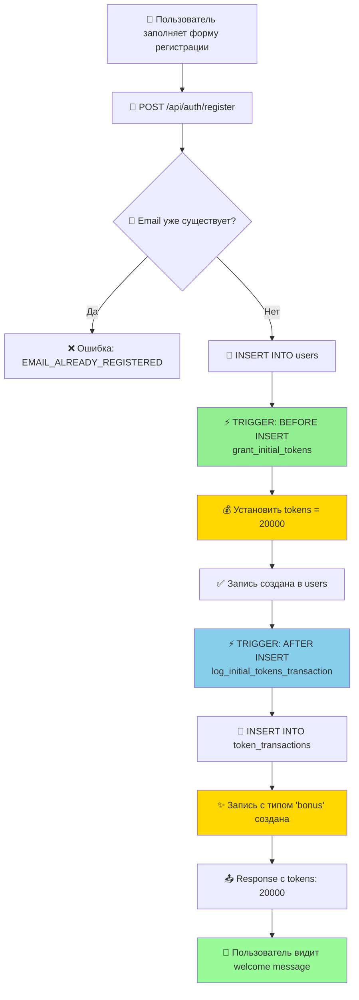
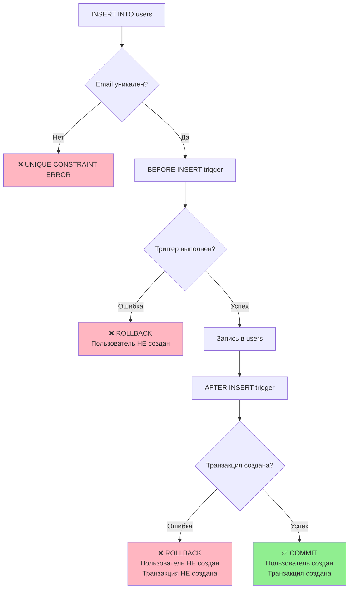

# 🔄 Схема работы автоматического начисления токенов

## Общий флоу регистрации пользователя



## Детальная схема работы триггеров

```
┌─────────────────────────────────────────────────────────────────┐
│                    INSERT INTO users                            │
│  (email, password_hash, name, company, role)                    │
└────────────────────────┬────────────────────────────────────────┘
                         │
                         ▼
         ┌───────────────────────────────────┐
         │  🔵 BEFORE INSERT TRIGGER         │
         │  set_initial_tokens_on_user_creation │
         └───────────────┬───────────────────┘
                         │
                         ▼
         ┌───────────────────────────────────┐
         │  Function: grant_initial_tokens() │
         │                                   │
         │  IF NEW.tokens IS NULL OR 0:      │
         │    NEW.tokens := 20000            │
         │                                   │
         │  RETURN NEW;                      │
         └───────────────┬───────────────────┘
                         │
                         ▼
         ┌───────────────────────────────────┐
         │  💾 ЗАПИСЬ В ТАБЛИЦУ users        │
         │                                   │
         │  id: uuid                         │
         │  email: string                    │
         │  name: string                     │
         │  company: string                  │
         │  tokens: 20000 ✅                 │
         │  created_at: timestamp            │
         └───────────────┬───────────────────┘
                         │
                         ▼
         ┌───────────────────────────────────────────┐
         │  🟢 AFTER INSERT TRIGGER                  │
         │  log_initial_tokens_on_user_creation      │
         └───────────────┬───────────────────────────┘
                         │
                         ▼
         ┌─────────────────────────────────────────────────────┐
         │  Function: log_initial_tokens_transaction()         │
         │                                                     │
         │  INSERT INTO token_transactions (                   │
         │    user_id: NEW.id::TEXT,                          │
         │    transaction_type: 'bonus',                      │
         │    amount: 20000,                                  │
         │    balance_after: NEW.tokens,                      │
         │    description: 'Welcome bonus: initial tokens grant', │
         │    metadata: {                                     │
         │      user_email: NEW.email,                        │
         │      user_name: NEW.name,                          │
         │      company: NEW.company,                         │
         │      granted_at: NOW()                             │
         │    }                                               │
         │  )                                                 │
         └───────────────┬─────────────────────────────────────┘
                         │
                         ▼
         ┌───────────────────────────────────┐
         │  📝 ЗАПИСЬ В token_transactions   │
         │                                   │
         │  Транзакция с типом 'bonus'      │
         │  зафиксирована в истории         │
         └───────────────┬───────────────────┘
                         │
                         ▼
         ┌───────────────────────────────────┐
         │  ✅ INSERT УСПЕШНО ЗАВЕРШЕН       │
         │                                   │
         │  RETURNING:                       │
         │    id, email, name, company,      │
         │    role, tokens, created_at       │
         └───────────────────────────────────┘
```

## Схема данных

### Таблица `users`

```
┌──────────────────────────────────────────┐
│              users                       │
├──────────────────────────────────────────┤
│ id              UUID (PK)                │
│ email           VARCHAR(255) UNIQUE      │
│ password_hash   VARCHAR(255)             │
│ name            VARCHAR(255)             │
│ company         VARCHAR(255)             │
│ role            user_role                │
│ tokens          INTEGER DEFAULT 20000 ⭐ │
│ created_at      TIMESTAMP                │
│ updated_at      TIMESTAMP                │
└──────────────────────────────────────────┘
```

### Таблица `token_transactions`

```
┌──────────────────────────────────────────┐
│        token_transactions                │
├──────────────────────────────────────────┤
│ id                 UUID (PK)             │
│ user_id            TEXT (FK → users.id)  │
│ transaction_type   ENUM                  │
│   • 'purchase'                           │
│   • 'consumed'                           │
│   • 'bonus'      ⭐ (для welcome)        │
│   • 'refund'                             │
│   • 'adjustment'                         │
│ amount             BIGINT                │
│ balance_after      BIGINT                │
│ description        TEXT                  │
│ metadata           JSONB                 │
│ created_at         TIMESTAMP             │
└──────────────────────────────────────────┘
```

## Пример данных после регистрации

### Запись в `users`:

```sql
id:            '550e8400-e29b-41d4-a716-446655440000'
email:         'john.doe@example.com'
password_hash: '$2b$10$...'
name:          'John Doe'
company:       'Acme Corporation'
role:          'hr'
tokens:        20000  ⭐
created_at:    '2026-01-29 10:30:00'
updated_at:    '2026-01-29 10:30:00'
```

### Запись в `token_transactions`:

```sql
id:               '660f9511-f3ac-52e5-b827-557766551111'
user_id:          '550e8400-e29b-41d4-a716-446655440000'
transaction_type: 'bonus'
amount:           20000
balance_after:    20000
description:      'Welcome bonus: initial tokens grant'
metadata:         {
                    "user_email": "john.doe@example.com",
                    "user_name": "John Doe",
                    "company": "Acme Corporation",
                    "granted_at": "2026-01-29T10:30:00.123Z"
                  }
created_at:       '2026-01-29 10:30:00'
```

## Временная шкала выполнения

```
T0: Начало INSERT
│
├─ T0+1ms:  Выполнение BEFORE INSERT trigger
│            - grant_initial_tokens()
│            - NEW.tokens = 20000
│
├─ T0+2ms:  Запись в таблицу users
│            - Пользователь создан
│
├─ T0+3ms:  Выполнение AFTER INSERT trigger
│            - log_initial_tokens_transaction()
│            - INSERT в token_transactions
│
└─ T0+4ms:  Завершение транзакции
             - COMMIT
             - RETURNING результат

Общее время: ~4-5ms ⚡
```

## Обработка ошибок



## Атомарность операций

```
┌─────────────────────────────────────────────────────┐
│              DATABASE TRANSACTION                   │
│                                                     │
│  BEGIN;                                            │
│                                                     │
│  ┌───────────────────────────────────────────┐    │
│  │  1. BEFORE INSERT trigger                 │    │
│  │     - Установка tokens = 20000            │    │
│  └───────────────────────────────────────────┘    │
│                                                     │
│  ┌───────────────────────────────────────────┐    │
│  │  2. INSERT INTO users                     │    │
│  │     - Создание пользователя               │    │
│  └───────────────────────────────────────────┘    │
│                                                     │
│  ┌───────────────────────────────────────────┐    │
│  │  3. AFTER INSERT trigger                  │    │
│  │     - INSERT INTO token_transactions      │    │
│  └───────────────────────────────────────────┘    │
│                                                     │
│  COMMIT; (ВСЁ ИЛИ НИЧЕГО) ✅                       │
│                                                     │
└─────────────────────────────────────────────────────┘
```

## API Response Flow

```
Frontend                    n8n Workflow                PostgreSQL
   │                             │                           │
   │  POST /api/auth/register    │                           │
   ├────────────────────────────>│                           │
   │                             │  INSERT INTO users        │
   │                             ├──────────────────────────>│
   │                             │                           │
   │                             │                  [Triggers execute]
   │                             │                           │
   │                             │  RETURNING id, email,     │
   │                             │  name, company, role,     │
   │                             │  tokens, created_at       │
   │                             │<──────────────────────────┤
   │                             │                           │
   │  {                          │                           │
   │    "success": true,         │                           │
   │    "user_id": "...",        │                           │
   │    "email": "...",          │                           │
   │    "tokens": 20000,         │                           │
   │    "message": "Account      │                           │
   │    created successfully     │                           │
   │    with 20,000 welcome      │                           │
   │    bonus tokens!"           │                           │
   │  }                          │                           │
   │<────────────────────────────┤                           │
   │                             │                           │
   ▼                             ▼                           ▼
```

## Преимущества такого подхода

### 1. ✅ Автоматизация

```
❌ Старый подход:
   1. INSERT user
   2. SELECT user_id
   3. INSERT token_transaction manually
   4. UPDATE user SET tokens = 20000
   
   Проблемы:
   - 4 операции
   - Риск race conditions
   - Можно забыть начислить токены
   
✅ Новый подход:
   1. INSERT user
   
   Преимущества:
   - 1 операция
   - Атомарно
   - Невозможно забыть
```

### 2. ✅ Консистентность данных

```
Гарантии:
✓ Каждый пользователь ВСЕГДА получит токены
✓ Каждое начисление ВСЕГДА логируется
✓ Операции ВСЕГДА атомарны (всё или ничего)
✓ Метаданные ВСЕГДА корректны
```

### 3. ✅ Простота использования

```javascript
// Разработчику нужно только:
const newUser = await db.query(`
  INSERT INTO users (email, password_hash, name, company, role)
  VALUES ($1, $2, $3, $4, 'hr')
  RETURNING *
`, [email, hash, name, company]);

// tokens уже установлены в 20000!
// транзакция уже создана!
// всё работает автоматически! 🎉
```

## Мониторинг и отладка

### Проверка триггеров

```sql
-- Список активных триггеров
SELECT trigger_name, event_manipulation, action_timing
FROM information_schema.triggers 
WHERE event_object_table = 'users';
```

### Статистика по welcome-бонусам

```sql
-- Сколько пользователей получили welcome-бонус
SELECT 
    COUNT(*) as total_bonuses,
    SUM(amount) as total_tokens,
    MIN(created_at) as first_bonus,
    MAX(created_at) as last_bonus
FROM token_transactions
WHERE transaction_type = 'bonus'
  AND description = 'Welcome bonus: initial tokens grant';
```

### Поиск пользователей без токенов (не должно быть!)

```sql
-- Аномалии: пользователи без токенов
SELECT id, email, tokens, created_at
FROM users
WHERE tokens < 20000 OR tokens IS NULL;
-- Ожидается: 0 записей
```

---

## 📚 Связанные документы

- `auto_grant_tokens_on_user_creation.sql` - SQL миграция
- `AUTO_GRANT_TOKENS_README.md` - полная документация
- `QUICK_START_AUTO_TOKENS.md` - быстрый старт
- `test_auto_tokens.sql` - тестовый скрипт
- `IMPLEMENTATION_SUMMARY_AUTO_TOKENS.md` - итоговая сводка

---

**💡 Ключевая идея:** Один INSERT → всё остальное происходит автоматически!
